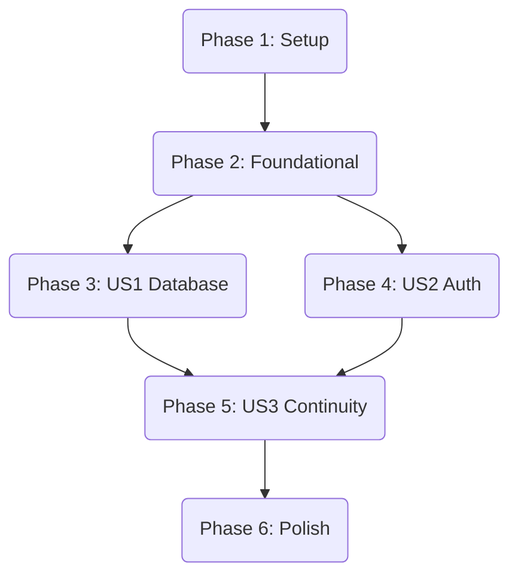

# Implementation Tasks: Phase II Compliance - Neon PostgreSQL + Better Auth Integration

**Feature**: 003-neon-better-auth
**Plan**: [plan.md](./plan.md)
**Spec**: [spec.md](./spec.md)

## Summary

This task list covers the migration from SQLite to Neon PostgreSQL and the transition from localStorage-based JWT to cookie-based Better Auth compatible authentication. The migration is organized to ensure data persistence and security compliance while maintaining feature continuity.

## Phase 1: Setup & Infrastructure
Goal: Prepare the environment and dependencies for PostgreSQL and cookie-based auth.

- [x] T001 Install `asyncpg` dependency and Remove `aiosqlite` in `backend/pyproject.toml`
- [x] T002 Update `backend/.env` with Neon `DATABASE_URL` (postgresql+asyncpg:// format)
- [x] T003 [P] Add `JWT_EXPIRY_DAYS=7` to `backend/.env`
- [x] T004 [P] Update `frontend/.env.local` with `NEXT_PUBLIC_API_URL` and `BETTER_AUTH_URL`

## Phase 2: Foundational Backend Changes
Goal: Configure async PostgreSQL connection and core authentication security.

- [x] T005 [P] Implement `create_async_engine` with `pool_pre_ping=True` in `backend/src/database.py`
- [x] T006 Update `get_session` to handle `AsyncSession` with PostgreSQL in `backend/src/database.py`
- [x] T007 Configure `CORSMiddleware` with `allow_credentials=True` in `backend/src/main.py`
- [x] T008 [P] Implement cookie extraction logic in `backend/src/auth.py` to read from `session_token` cookie

## Phase 3: User Story 1 - Database Migration to Cloud (Priority: P1)
Goal: Ensure data persists in Neon PostgreSQL across server restarts.

- [x] T009 [US1] Update `SQLModel` metadata creation logic for PostgreSQL in `backend/src/main.py`
- [x] T010 [US1] Add a `/health` endpoint that verifies active connection to Neon in `backend/src/main.py`
- [x] T011 [US1] Verify task creation persists in Neon via manual test or curl per `quickstart.md`

## Phase 4: User Story 2 - Cookie-Based Authentication (Priority: P2)
Goal: Replace localStorage with secure HttpOnly cookies and Better Auth compatible responses.

- [x] T012 [US2] Implement `/api/v1/auth/signup` returning `{ user, session }` and setting cookie in `backend/src/routes/auth.py`
- [x] T013 [US2] Implement `/api/v1/auth/signin` with `response.set_cookie` (HttpOnly, SameSite=Lax) in `backend/src/routes/auth.py`
- [x] T014 [US2] Implement `/api/v1/auth/session` to return current user/session from cookie in `backend/src/routes/auth.py`
- [x] T015 [US2] Implement `/api/v1/auth/signout` to clear the `session_token` cookie in `backend/src/routes/auth.py`
- [x] T016 [US2] Update `apiClient` to use `credentials: 'include'` in `frontend/lib/api.ts`
- [x] T017 [US2] Refactor `useAuth` hook to remove `localStorage` and rely on cookie-based session in `frontend/hooks/useAuth.tsx`

## Phase 5: User Story 3 - Seamless Feature Continuity (Priority: P3)
Goal: Verify all existing features (Tags, Search, Filter) work with the new infrastructure.

- [x] T018 [US3] Verify Tag CRUD and associations work with PostgreSQL in `backend/src/routes/tags.py`
- [x] T019 [US3] Verify Search and Filter logic remains functional with PostgreSQL syntax in `backend/src/routes/tasks.py`
- [x] T020 [US3] Perform end-to-end verification of User Isolation (User A cannot see User B's tasks)

## Phase 6: Polish & Cleanup
Goal: Remove legacy code and finalize the migration.

- [x] T021 Remove legacy SQLite database file `backend/todo_app.db` and references in `.gitignore`
- [x] T022 Remove any remaining `Authorization: Bearer` manual header injections in frontend
- [x] T023 Final verify of session persistence (7 days) per requirements

## Dependency Graph

## Parallel Execution Examples

### Within User Story 2 (Auth)
- T012 (Signup) and T013 (Signin) can be developed in parallel as they share similar cookie logic.
- T016 (API Client) can be updated while backend endpoints are being built.

## Implementation Strategy

- **MVP First**: Complete US1 (Database) first to ensure persistence is working.
- **Incremental Delivery**: Roll out the Auth changes (US2) after the database is stable.
- **Continuous Verification**: Use the `quickstart.md` test scenarios after each phase.
